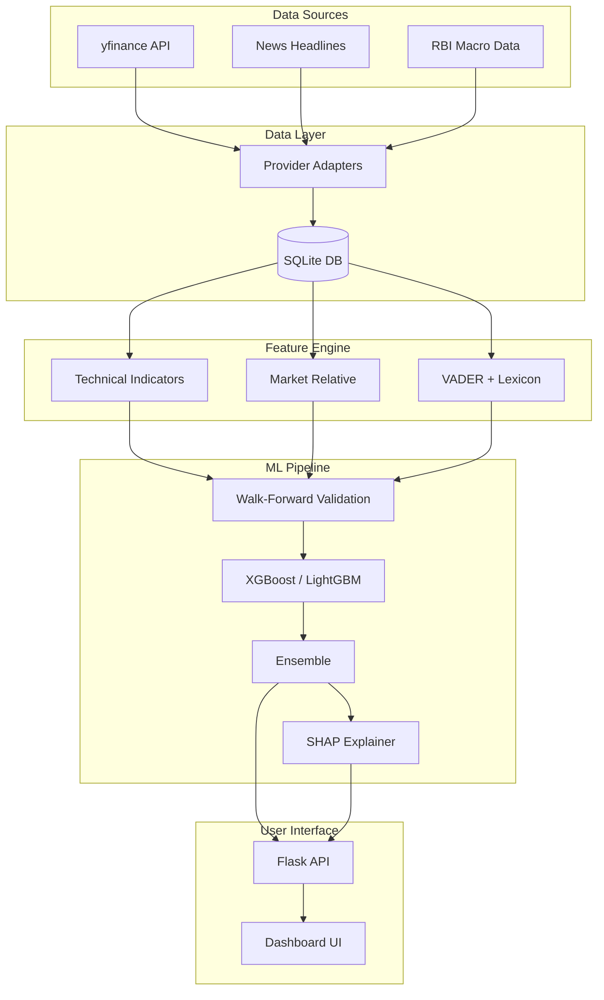

# BankSight AI

**Explainable Multi-Modal Banking Market Forecasting System**

A production-quality AI system designed to forecast the movement of the top 5 Indian banking stocks (HDFC, ICICI, SBI, Axis, Kotak). It uses historical market data, technical indicators, news sentiment NLP, and historical event similarity to generate forecasts and explain *why* the model made its decision.

## Features

1.  **Multi-Horizon Forecasting**: Predicts 1-day, 5-day, and 7-day returns.
2.  **Explainability First (SHAP)**: Every prediction is accompanied by a SHAP-generated explanation detailing the top positive and negative contributing factors.
3.  **Strict Anti-Leakage Feature Engineering**: Point-in-time feature construction ensures the model never sees future data during training.
4.  **Walk-Forward Validation**: Uses rolling time-windows for training to respect the temporal nature of financial data, rather than random train/test splits.
5.  **News Sentiment Engine**: Uses VADER combined with a custom financial lexicon to evaluate the sentiment and importance of banking news.
6.  **Historical Event Similarity**: Encodes the current market state into a feature vector and uses cosine similarity to find the most comparable historical scenarios and their outcomes.
7.  **Adapter Architecture**: Data providers (yfinance, NewsAPI) are decoupled behind an interface, allowing seamless upgrading to premium feeds in the future.
8.  **Professional Dashboard**: A dark-themed, responsive web UI built with Flask and Chart.js.

## Architecture



## Installation & Setup

1.  **Install Requirements**
    ```bash
    pip install -r requirements.txt
    ```

2.  **Environment Variables**
    Copy `.env.example` to `.env`. For basic usage, no API keys are required as it defaults to `yfinance`.
    ```bash
    copy .env.example .env
    ```

3.  **Run Setup Pipeline**
    This will initialize the database, download maximum available historical data, compute features, train the initial walk-forward models, and generate the first set of predictions.
    ```bash
    python setup.py
    ```

4.  **Start the Server**
    ```bash
    python app.py
    ```
    Navigate to `http://localhost:5000` to view the dashboard.

## Running Individual Components

- **Train models**: `python src/train.py`
- **Generate new predictions**: `python src/predict.py`
- **Run tests**: `pytest tests/test_system.py -v`

## Limitations & Disclaimers

- **Not Financial Advice**: This system is for research and educational purposes only.
- **Data Availability**: The free `yfinance` provider may experience rate limiting or missing data points. The system is designed to gracefully handle these gaps, but prediction accuracy depends heavily on data quality.
- **Market Dynamics**: Financial markets are non-stationary. The walk-forward validation attempts to adapt to changing regimes, but past performance does not guarantee future results.
