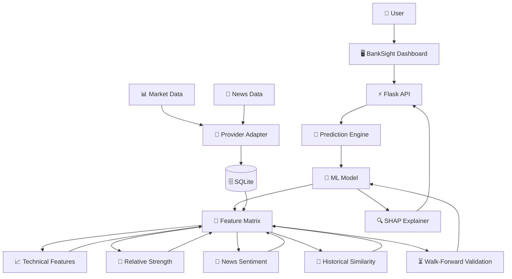
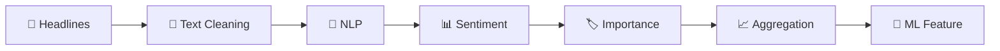
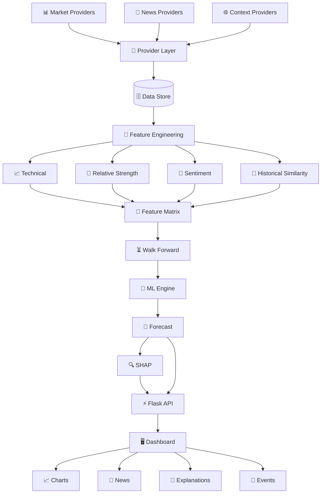
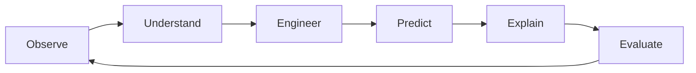

<!-- ========================================================= -->

<!--                    BANKSIGHT AI README                   -->

<!-- ========================================================= -->

<div align="center">


<br/>


<br/>

### 🏦 **An Explainable AI Market Intelligence Platform**

**Market Data → Feature Intelligence → Machine Learning → Forecast → SHAP → Human-Readable Insight**

<br/>

<a href="https://github.com/jashchothani/BankSight-AI">

</a>

<a href="https://github.com/jashchothani/BankSight-AI/issues">

</a>

<a href="https://github.com/jashchothani/BankSight-AI">

</a>

<br/><br/>


</div>

---

# ⚡ QUICK START

> **Get BankSight AI running before diving into the architecture.**

### 01 — Clone

```bash
git clone https://github.com/jashchothani/BankSight-AI.git
cd BankSight-AI
```

### 02 — Create environment

#### Windows

```bash
python -m venv venv
venv\Scripts\activate
```

#### Linux / macOS

```bash
python3 -m venv venv
source venv/bin/activate
```

### 03 — Install dependencies

```bash
pip install -r requirements.txt
```

### 04 — Configure environment

```bash
copy .env.example .env
```

Linux / macOS:

```bash
cp .env.example .env
```

Open `.env` and configure the available data/news provider credentials.

```env
# ==============================
# BANKSIGHT AI CONFIGURATION
# ==============================

# Application
FLASK_ENV=development
FLASK_DEBUG=true

# Market Data
MARKET_DATA_PROVIDER=yfinance

# News
NEWS_PROVIDER=

# Optional API credentials
NEWS_API_KEY=
FINANCIAL_DATA_API_KEY=

# Database
DATABASE_PATH=data/banksight.db

# ML
MODEL_DIR=models/
FORECAST_HORIZONS=1,5,7

# Logging
LOG_LEVEL=INFO
```

> 🔐 **Never commit real API keys to GitHub.**
>
> Keep credentials inside `.env`.

### 05 — Initialize

```bash
python setup.py
```

### 06 — Start BankSight AI

```bash
python app.py
```

### 07 — Open

```text
http://localhost:5000
```

<br/>

<div align="center">

### 🚀 That's it.

**Your explainable banking-market intelligence dashboard is running.**

</div>

---

# 🧭 NAVIGATION

<details>
<summary><b>📚 Open Documentation Menu</b></summary>

<br/>

* [⚡ Quick Start](#-quick-start)
* [🏦 What is BankSight AI?](#-what-is-banksight-ai)
* [✨ Core Capabilities](#-core-capabilities)
* [🧠 AI Architecture](#-ai-architecture)
* [📊 Data Pipeline](#-data-pipeline)
* [🤖 Machine Learning](#-machine-learning-engine)
* [🔍 Explainable AI](#-explainable-ai)
* [📰 News Intelligence](#-news-intelligence)
* [🔎 Historical Similarity](#-historical-event-intelligence)
* [📈 Forecast Engine](#-forecast-engine)
* [📉 Interactive Timeline](#-interactive-market-timeline)
* [🏗️ System Architecture](#️-system-architecture)
* [🗂️ Project Structure](#️-project-structure)
* [⚙️ Configuration](#️-configuration)
* [🧪 Testing](#-testing)
* [📊 Evaluation](#-model-evaluation)
* [🛡️ Anti-Leakage](#️-anti-leakage)
* [🔮 Roadmap](#-roadmap)
* [🤝 Contributing](#-contributing)
* [⚠️ Disclaimer](#️-disclaimer)

</details>

---

# 🏦 WHAT IS BANKSIGHT AI?

<div align="center">

### **Don't just ask where the price is.**

### **Understand what is driving the market signal.**

</div>

BankSight AI is an **explainable machine-learning platform for banking-market intelligence**.

It combines multiple information layers:

```text
                 ┌─────────────────────────┐
                 │       MARKET DATA       │
                 └────────────┬────────────┘
                              │
        ┌─────────────────────┼─────────────────────┐
        │                     │                     │
        ▼                     ▼                     ▼
   📊 PRICE DATA         📈 TECHNICAL          📰 NEWS
                             SIGNALS
        │                     │                     │
        └─────────────────────┼─────────────────────┘
                              ▼
                   ┌──────────────────────┐
                   │ FEATURE INTELLIGENCE │
                   └──────────┬───────────┘
                              ▼
                   ┌──────────────────────┐
                   │   ML FORECAST ENGINE │
                   └──────────┬───────────┘
                              ▼
                  ┌────────────────────────┐
                  │ MULTI-HORIZON FORECAST │
                  └────────────┬───────────┘
                               ▼
                       🔍 SHAP EXPLAINER
                               │
                               ▼
                  ┌────────────────────────┐
                  │ HUMAN-READABLE INSIGHT │
                  └────────────────────────┘
```

---

# ✨ CORE CAPABILITIES

<div align="center">

|          🧠 AI         |     📊 MARKET     |   🔍 EXPLAINABILITY  |
| :--------------------: | :---------------: | :------------------: |
|    Multi-horizon ML    | Historical prices |         SHAP         |
|  Ensemble forecasting  | Technical signals | Feature contribution |
|  Walk-forward training | Relative strength | Prediction reasoning |
| Time-series validation |   Market context  |  Event explanations  |

|       📰 NEWS      |     ⚡ PLATFORM     |    🛡️ ENGINEERING    |
| :----------------: | :----------------: | :-------------------: |
| Sentiment analysis |        Flask       |      Anti-leakage     |
|  Financial lexicon | Interactive charts |   Modular providers   |
| Event intelligence |      Dashboard     |   Automated testing   |
|    News context    |       SQLite       | Reproducible pipeline |

</div>

---

# 🌌 THE BANKSIGHT AI UNIVERSE

```text
                         ✦ BANKSIGHT AI ✦

                              ◉
                           FORECAST
                              │
                    ╭─────────┴─────────╮
                    │                   │
                 SHAP AI             NEWS AI
                    │                   │
                    │                   │
              TECHNICAL AI        EVENT MEMORY
                    │                   │
                    ╰─────────┬─────────╯
                              │
                         MARKET DATA
                              │
             ┌────────────────┼────────────────┐
             │                │                │
           HDFC             ICICI             SBI
             │                │                │
             └───────────────┼────────────────┘
                             │
                         BANKING AI
```

---

# 🧠 AI ARCHITECTURE



---

# 📊 DATA PIPELINE

<div align="center">

### **Raw Data → Clean Data → Features → Model → Insight**

```mermaid
flowchart LR

    A["📡 Data Providers"]
    B["🧹 Validation"]
    C["🧽 Cleaning"]
    D["🕒 Point-in-Time Alignment"]
    E["🧬 Feature Engineering"]
    F["🎯 Target Generation"]
    G["🤖 Training"]
    H["🔮 Forecast"]
    I["🔍 Explain"]
    J["📊 Dashboard"]

    A --> B --> C --> D --> E --> F --> G --> H --> I --> J
```

</div>



---

# 🤖 MACHINE LEARNING ENGINE

BankSight AI is designed around **time-aware forecasting**, not ordinary random train/test splitting.

### Model lifecycle

```text
              HISTORICAL DATA
                     │
                     ▼
              DATA VALIDATION
                     │
                     ▼
           POINT-IN-TIME FEATURES
                     │
                     ▼
             FEATURE MATRIX
                     │
                     ▼
          ┌─────────────────────┐
          │ WALK-FORWARD TRAIN  │
          └──────────┬──────────┘
                     │
                     ▼
               ML FORECAST
                     │
           ┌─────────┼─────────┐
           ▼         ▼         ▼
         +1D       +5D       +7D
           │         │         │
           └─────────┼─────────┘
                     ▼
                SHAP LAYER
                     │
                     ▼
              MARKET INSIGHT
```

---

# 🧬 FEATURE INTELLIGENCE

BankSight AI can combine several feature families.

### 📈 Technical

```text
Price
Returns
Momentum
Trend
Volatility
Relative movement
Technical indicators
```

### 🏦 Cross-Bank

```text
Bank-relative performance
Cross-sectional movement
Relative momentum
Banking-universe context
```

### 📰 NLP

```text
Headline sentiment
Financial vocabulary
News importance
Aggregated sentiment
Recent sentiment change
```

### 🔎 Historical Context

```text
Market-state vector
Similarity matching
Historical analogues
Historical outcomes
```

---

# 🛡️ ANTI-LEAKAGE

### One of the most important parts of the system.

Financial forecasting becomes meaningless if the model accidentally sees information from the future.

BankSight AI therefore emphasizes:

```text
                  PREDICTION TIME
                         │
                         ▼
─────────────────────────●──────────────────────────────
        PAST              │             FUTURE
                          │
    AVAILABLE             │           UNKNOWN
    INFORMATION           │           INFORMATION
                          │
          ┌───────────────┘
          │
          ▼
   FEATURE GENERATION
          │
          ▼
      ML MODEL
          │
          ▼
      FORECAST
```

### Principle

> **If information was not available at prediction time, it should not influence the feature.**

---

# ⏳ WALK-FORWARD VALIDATION

Instead of:

```text
Random Train / Test
```

BankSight AI follows a temporal approach:

```text
TIME ───────────────────────────────────────────────────►

TRAIN ████████████████ TEST ██

          TRAIN ████████████████ TEST ██

                    TRAIN ████████████████ TEST ██

                              TRAIN ████████████████ TEST ██
```

This better represents how a real forecasting system encounters new observations over time.

---

# 🔮 FORECAST ENGINE

BankSight AI is designed for multiple prediction horizons.

```text
                 FORECAST ENGINE
                       │
        ┌──────────────┼──────────────┐
        │              │              │
        ▼              ▼              ▼
      +1 DAY         +5 DAYS        +7 DAYS
        │              │              │
        ▼              ▼              ▼
    SHORT TERM      SWING VIEW     EXTENDED VIEW
```

Each horizon can be evaluated independently.

---

# 🔍 EXPLAINABLE AI

<div align="center">

## **Prediction ≠ Explanation**

</div>

The system uses SHAP-based analysis to investigate which features influence the model output.

```text
                     MODEL
                       │
                       ▼
                  PREDICTION
                       │
                       ▼
                     SHAP
                       │
       ┌───────────────┼───────────────┐
       ▼               ▼               ▼
   POSITIVE         NEGATIVE          LOW
   FEATURES         FEATURES         IMPACT
       │               │               │
       ▼               ▼               ▼
   Momentum        Volatility       Minor
   Sentiment       Weakness         Signals
   Strength        Pressure
       │               │               │
       └───────────────┼───────────────┘
                       ▼
                 EXPLANATION
```

---

# 📊 SHAP VISUALIZATION CONCEPT

```text
MODEL OUTPUT
│
├── 📈 Momentum              ████████████████  +
├── 📰 News Sentiment        ███████████       +
├── 🏦 Relative Strength     █████████         +
├── 📉 Volatility            ███████           -
├── 📊 Recent Return         █████             -
└── 🌐 Market Context        ██                -
```

The actual dashboard should use live model-generated contributions rather than hard-coded values.

---

# 📰 NEWS INTELLIGENCE



### Signal flow

```text
NEWS
 ↓
TEXT
 ↓
SENTIMENT
 ↓
IMPORTANCE
 ↓
TIME ALIGNMENT
 ↓
FEATURE
 ↓
MODEL
```

---

# 🔎 HISTORICAL EVENT INTELLIGENCE

BankSight AI can compare the current market state with historical states.

```text
CURRENT STATE
      │
      ▼
┌────────────────────────┐
│ Market-State Vector    │
│                        │
│ Momentum               │
│ Volatility             │
│ Returns                │
│ Relative Strength      │
│ Sentiment              │
└────────────┬───────────┘
             │
             ▼
       SIMILARITY SEARCH
             │
      ┌──────┼──────┐
      ▼      ▼      ▼
   EVENT A EVENT B EVENT C
      │      │      │
      └──────┼──────┘
             ▼
     HISTORICAL OUTCOMES
             │
             ▼
       CONTEXT SIGNAL
```

---

# 📉 INTERACTIVE MARKET TIMELINE

### One of the most important UX concepts.

Instead of showing only:

```text
Price ────────────────╱╲────────╲────
```

the dashboard should allow the user to **select a historical point**:

```text
PRICE
 │
 │               ╭───╮
 │              ╱     ╲
 │       ╭─────╯       ╲
 │      ╱                ╲
 │─────╯                  ╲____
 │
 └────────────────────────────────► TIME
                     ▲
                     │
                SELECT POINT
                     │
                     ▼
             ┌───────────────┐
             │ WHY THE MOVE? │
             └───────┬───────┘
                     │
       ┌─────────────┼─────────────┐
       ▼             ▼             ▼
     NEWS        TECHNICAL       MARKET
   SENTIMENT       SIGNALS       CONTEXT
```

This transforms the chart into an **investigation interface**.

---

# 🏗️ SYSTEM ARCHITECTURE



---

# 🗂️ PROJECT STRUCTURE

```text
BankSight-AI/
│
├── 📁 dashboard/
│   ├── templates/
│   ├── static/
│   └── dashboard assets
│
├── 📁 src/
│   ├── data/
│   ├── features/
│   ├── models/
│   ├── prediction/
│   ├── explainability/
│   └── utilities/
│
├── 📁 tests/
│
├── 📁 data/
│
├── 📁 models/
│
├── 📄 app.py
├── 📄 config.py
├── 📄 setup.py
├── 📄 requirements.txt
├── 📄 .env.example
└── 📄 README.md
```

---

# ⚙️ CONFIGURATION

Create:

```text
.env
```

from:

```text
.env.example
```

### Example

```env
# ═══════════════════════════════════════
# BANKSIGHT AI
# ENVIRONMENT CONFIGURATION
# ═══════════════════════════════════════

# Application
FLASK_ENV=development
FLASK_DEBUG=true

# ───────────────────────────────────────
# DATA
# ───────────────────────────────────────

MARKET_DATA_PROVIDER=yfinance

# ───────────────────────────────────────
# NEWS
# ───────────────────────────────────────

NEWS_PROVIDER=
NEWS_API_KEY=

# ───────────────────────────────────────
# OPTIONAL FINANCIAL DATA
# ───────────────────────────────────────

FINANCIAL_DATA_API_KEY=

# ───────────────────────────────────────
# DATABASE
# ───────────────────────────────────────

DATABASE_PATH=data/banksight.db

# ───────────────────────────────────────
# MACHINE LEARNING
# ───────────────────────────────────────

MODEL_DIR=models/

FORECAST_HORIZONS=1,5,7

# ───────────────────────────────────────
# LOGGING
# ───────────────────────────────────────

LOG_LEVEL=INFO
```

---

# 🔌 PROVIDER ARCHITECTURE

BankSight AI uses provider abstraction so the application can evolve without rewriting the entire ML pipeline.

```text
                 PROVIDER INTERFACE
                         │
        ┌────────────────┼────────────────┐
        ▼                ▼                ▼
     Provider A       Provider B       Provider C
        │                │                │
        └────────────────┼────────────────┘
                         ▼
                  NORMALIZED DATA
                         │
                         ▼
                FEATURE ENGINE
```

### Why this matters

If one provider changes:

```text
Provider changes
       ↓
Adapter changes
       ↓
Normalized interface remains
       ↓
ML pipeline remains
       ↓
Dashboard remains
```

---

# 🧪 TESTING

Run:

```bash
pytest tests/test_system.py -v
```

Expected testing layers:

```text
DATA
 ↓
VALIDATION
 ↓
FEATURES
 ↓
TARGETS
 ↓
MODEL
 ↓
PREDICTION
 ↓
API
 ↓
DASHBOARD
```

---

# 📊 MODEL EVALUATION

BankSight AI should never advertise fabricated model accuracy.

Evaluation should be generated from actual walk-forward experiments.

Recommended metrics:

| Metric               | Purpose                    |
| -------------------- | -------------------------- |
| MAE                  | Average prediction error   |
| RMSE                 | Penalizes larger errors    |
| Directional Accuracy | Correct movement direction |
| Precision            | Positive movement quality  |
| Recall               | Positive movement coverage |
| Stability            | Performance consistency    |
| Calibration          | Confidence reliability     |

### Evaluation philosophy

```text
          MODEL QUALITY
                │
       ┌────────┼────────┐
       ▼        ▼        ▼
     ERROR   DIRECTION  STABILITY
       │        │        │
       └────────┼────────┘
                ▼
        WALK-FORWARD TEST
                │
                ▼
         HONEST EVALUATION
```

---

# 🏦 BANKING UNIVERSE

<div align="center">

| Bank                   | Symbol      | Role           |
| ---------------------- | ----------- | -------------- |
| 🏦 HDFC Bank           | `HDFCBANK`  | Banking signal |
| 🏦 ICICI Bank          | `ICICIBANK` | Banking signal |
| 🏦 State Bank of India | `SBIN`      | Banking signal |
| 🏦 Axis Bank           | `AXISBANK`  | Banking signal |
| 🏦 Kotak Mahindra Bank | `KOTAKBANK` | Banking signal |

</div>

---

# 🎨 UI / UX VISION

BankSight AI is designed around a modern financial terminal aesthetic.

### Visual language

```text
╭────────────────────────────────────────────╮
│  BANKSIGHT AI                         ● LIVE│
├────────────────────────────────────────────┤
│                                            │
│  HDFC BANK          FORECAST               │
│  ₹ XXXX.XX          ↗ +X.XX%               │
│                                            │
│  ╭──────────────────────────────────────╮  │
│  │        ╱╲         ╭───╮              │  │
│  │     ╭─╯  ╲───────╯   ╲──             │  │
│  │ ────╯                               │  │
│  ╰──────────────────────────────────────╯  │
│                                            │
│  🧠 WHY?                                   │
│  ┌──────────────┐ ┌──────────────┐        │
│  │ Momentum  +  │ │ Sentiment +  │        │
│  └──────────────┘ └──────────────┘        │
│                                            │
╰────────────────────────────────────────────╯
```

---

# 🌐 FRONTEND TECHNOLOGY

```text
             BANKSIGHT DASHBOARD
                     │
        ┌────────────┼────────────┐
        ▼            ▼            ▼
      Charts       Forecast      News
        │            │            │
        └────────────┼────────────┘
                     ▼
                  Flask API
                     │
                     ▼
                ML ENGINE
```

---

# 🧠 THE INTELLIGENCE LOOP



### BankSight's philosophy

> **Observe → Understand → Predict → Explain → Evaluate → Improve**

---

# 📡 LIVE DATA FLOW

```text
         DATA SOURCES
              │
              ▼
        ┌────────────┐
        │ INGESTION  │
        └─────┬──────┘
              │
              ▼
        ┌────────────┐
        │ VALIDATION │
        └─────┬──────┘
              │
              ▼
        ┌────────────┐
        │ FEATURES   │
        └─────┬──────┘
              │
              ▼
        ┌────────────┐
        │ ML ENGINE  │
        └─────┬──────┘
              │
       ┌──────┴──────┐
       ▼             ▼
   FORECAST        SHAP
       │             │
       └──────┬──────┘
              ▼
          DASHBOARD
```

---

# 📈 THE THREE-LAYER FORECAST

```text
                  FORECAST
                     │
        ┌────────────┼────────────┐
        ▼            ▼            ▼
      PRICE       DIRECTION     CONTEXT
        │            │            │
        ▼            ▼            ▼
    Expected      Up / Down    Why?
    movement      signal       Signals
        │            │            │
        └────────────┼────────────┘
                     ▼
              FINAL INSIGHT
```

---

# 🧠 DESIGN PRINCIPLES

```text
┌─────────────────────────────────────┐
│         BANKSIGHT PRINCIPLES        │
├─────────────────────────────────────┤
│                                     │
│  01  Temporal correctness           │
│  02  Explainable predictions        │
│  03  Modular providers              │
│  04  Reproducible experiments       │
│  05  No fabricated metrics          │
│  06  Anti-leakage features          │
│  07  Human-readable intelligence    │
│  08  Production-oriented design     │
│                                     │
└─────────────────────────────────────┘
```

---

# 🔐 SECURITY

Never commit:

```text
API keys
Tokens
Passwords
Credentials
Private configuration
```

Use:

```text
.env
```

and maintain:

```text
.env.example
```

for reproducible setup.

---

# 🤝 CONTRIBUTING

Contributions are welcome.

```text
Fork
  ↓
Create branch
  ↓
Build feature
  ↓
Test
  ↓
Commit
  ↓
Pull Request
```

Example:

```bash
git checkout -b feature/improved-news-model

git add .

git commit -m "feat: improve financial news features"

git push origin feature/improved-news-model
```

---

# 📜 LICENSE

Add the project's chosen license here.

If the repository is intended for open-source collaboration, consider adding an explicit `LICENSE` file to the repository.

---

# ⚠️ DISCLAIMER

<div align="center">

### 🛑 IMPORTANT

**BankSight AI is an educational and research-oriented machine-learning project.**

It does **not** provide guaranteed future prices, financial advice, or investment recommendations.

Machine-learning forecasts can be wrong.

Financial markets are affected by:

`Macro Conditions` · `Interest Rates` · `Corporate Events` · `Regulation` · `Liquidity` · `Global Markets` · `Unexpected News`

**Never treat a model prediction as certainty.**

</div>

---

# 🌟 WHY BANKSIGHT?

<div align="center">

### Traditional Dashboard

```text
PRICE
  ↓
CHART
  ↓
USER
```

### BankSight AI

```text
MARKET
   ↓
DATA
   ↓
FEATURES
   ↓
MACHINE LEARNING
   ↓
MULTI-HORIZON FORECAST
   ↓
SHAP EXPLANATION
   ↓
NEWS + EVENTS
   ↓
HUMAN-READABLE INSIGHT
```

</div>

---

# 🏁 FINAL VISION

<div align="center">


<br/><br/>

### **BankSight AI**

**See the market.**

**Understand the signal.**

**Question the prediction.**

**Explore the evidence.**

<br/>


</div>

---

<div align="center">

### 🏦 BANKSIGHT AI

`Market Data` → `Feature Intelligence` → `Machine Learning` → `Forecast` → `Explainability`

**Built with Python • Flask • XGBoost/LightGBM • SHAP • Pandas • Chart.js**

<br/>


</div>
